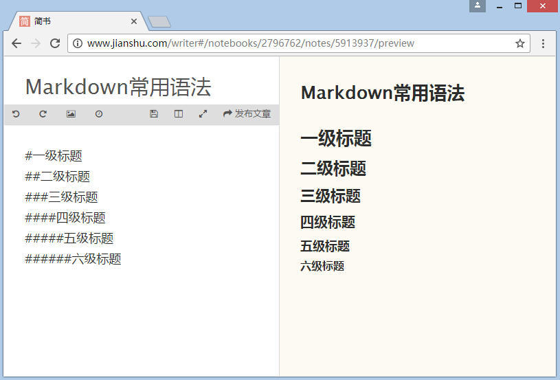
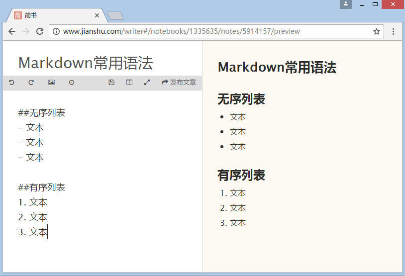
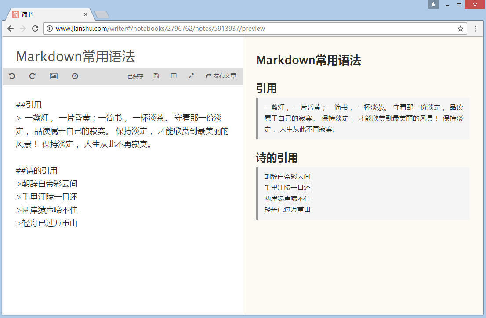
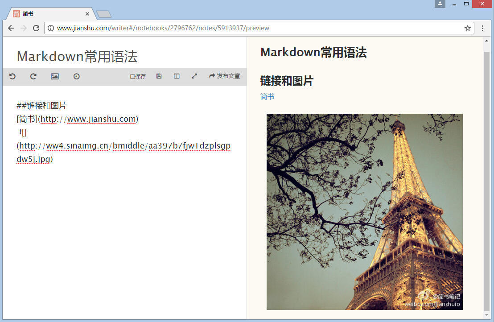
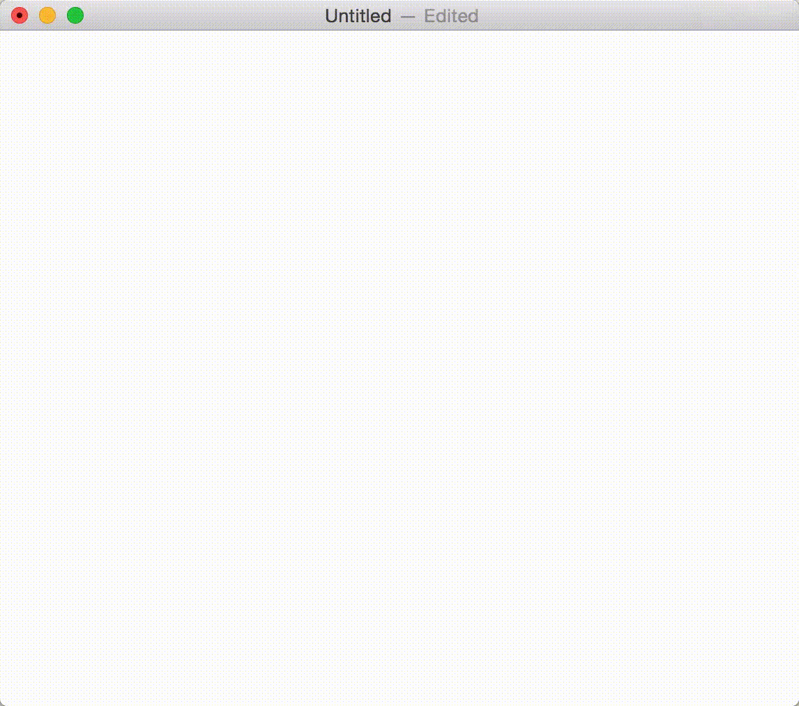
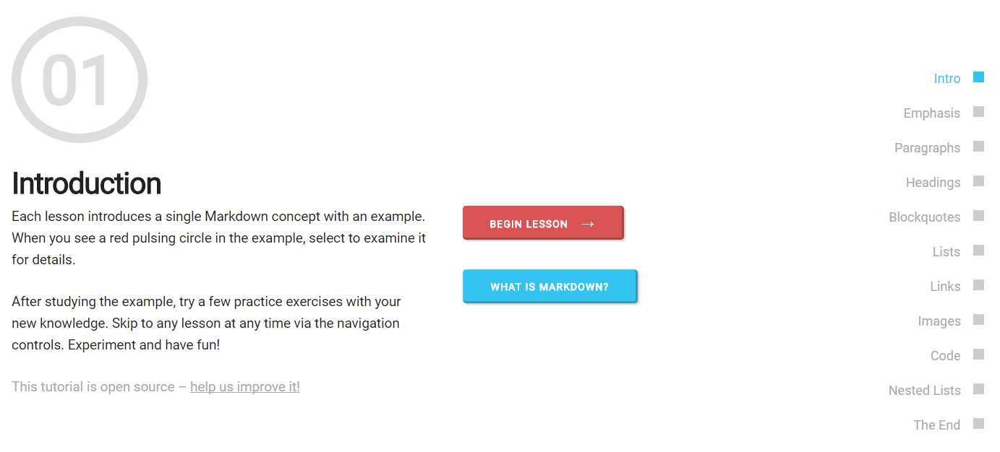

# 一. [认识Markdown](https://www.youtube.com/watch?v=0Llb9fhoJaI)

## 1. 写文档会碰到什么难题

* 难以专心：写Word文档的时候，我们经常浪费大量时间在Word本身上，特别是那80%我们用不到的功能。

* 浪费力气在排版上：我们会花费大量力气去排版，试图让文档变得漂亮一些。是粗体还是斜体，是宋体还是黑体，缩进多少？

## 2. Markdown是什么？

* Markdown是一种轻量级的**[标记语言]**。

> 你们现在看到的，仅仅是冰山一角」（小标题）

  上述标题用 Markdown 改写后是这样的：

> \#\#	你们现在看到的，仅仅是冰山一角」

Markdown诞生于互联网时代，它用简洁的语法代替排版，而不像word等软件有大量排版、字体设置。这个语法简单到每个人都可以在5分钟以内学会。一旦熟悉它的语法规则，会有一劳永逸的效果。


## 3. 使用Markdown有什么好处？

* 纯文本，所以兼容性极强，可以用所有文本编辑器打开。
* 让你专注于文字而不是排版。
* 格式转换方便，Markdown 的文本你可以轻松转换为 html、PDF、Word等。
* 可读，直观。

# 二. Markdown 语法简介 

* ## 标题

  

  ***

* ## 列表

  ## 

* ## 引用

  ## 

* ## 图片与链接

  ## 

* ## 粗体与斜体

  Markdown 的粗体和斜体也非常简单：

  * 用两个 ** 包含一段文本就是粗体的语法，
  * 用一个 * 包含一段文本就是斜体的语法。

  例如：这里是**粗体** 这里是*斜体*

* ##数学公式编辑


* ## 代码框

  ```sas
  data air;
      set sashelp.air;
  run;
  proc print data=air;
  run;
  ```

* ## 流程图

  > st=>start: Start
  > op=>operation: Your Operation
  > cond=>condition: Yes or No?
  > e=>end
  >
  > st->op->cond
  > cond(yes)->e
  > cond(no)->op


```flow
st=>start: Start
op=>operation: Your Operation
cond=>condition: Yes or No?
e=>end

st->op->cond
cond(yes)->e
cond(no)->op
```

# 三. 推荐
1. ## [Typora](https://typora.io/)

  ## [安利一下Typora：极致简洁的markdown编辑器](http://www.jianshu.com/p/5256ecc06eec)

* 

2. ## [Markdown语法参考和指导](http://commonmark.org/help/)

  ​

  

3. ## R Markdown

  ## [R Markdown from R Studio](http://rmarkdown.rstudio.com/)
